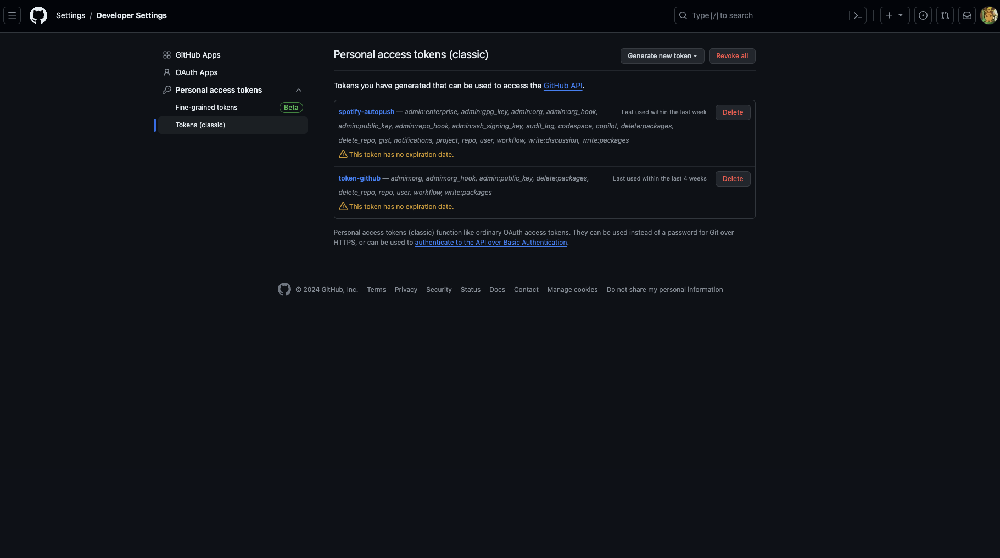

# spotify-autopush


## 💻・About

Spotify-Autopush is a program to display on your Github account your last album played so you can show the world your great musical tastes (nobody cares)

## 🎯・Setup

### Add a personnal access token from Settings/Developer Settings:

- Add `repo` authorization.
- Add `user` authorization.



### Create an application from [Spotify Developers Dashboar](https://developer.spotify.com/dashboard)

- APIs used parameters: `Web API` & `Web Playback SDK`
- Save `Client ID` and `Client Secret`

If you need to configure `Redirect URLs` refer to [this page](https://community.spotify.com/t5/Spotify-for-Developers/Redirect-URI-needed/td-p/5067419)

### Configure your environment variables in `.env`

```bash
cp .env.example .env
```

## 📚・Ressources

- [Spotify API](https://developer.spotify.com/documentation/web-api)
- [Github API](https://docs.github.com/en/rest/users/users?apiVersion=2022-11-28)

## 🧑‍🤝‍🧑・Contributing

To use spotify-autopush in development, follow these steps:

1. Fork the project.

2. Install poetry.

```sh
curl -sSL https://install.python-poetry.org | python3 -
```

3. Create a branch with [conventionnal name](https://tilburgsciencehub.com/building-blocks/collaborate-and-share-your-work/use-github/naming-git-branches/).

   - fix: `bugfix/the-bug-fixed`
   - features: `feature/the-amazing-feature`
   - test: `test/the-famous-test`
   - hotfix `hotfix/oh-my-god-bro`
   - wip `wip/the-work-name-in-progress`

4. Configure your environment variables in `.env`.

```
SPOTIFY_CLIENT_ID=
SPOTIFY_CLIENT_SECRET=
SPOTIFY_REDIRECT_URI=
GITHUB_USERNAME=
GITHUB_PERSONAL_ACCESS_TOKEN=
```

## 🎯・Roadmap

- [ ] Create a CLI
- [ ] Push the last album played on my portfolio
- [ ] Display more informations about the album

## 📑・Licence

This project is under MIT license. For more information, please see the file [LICENSE](./LICENSE).
